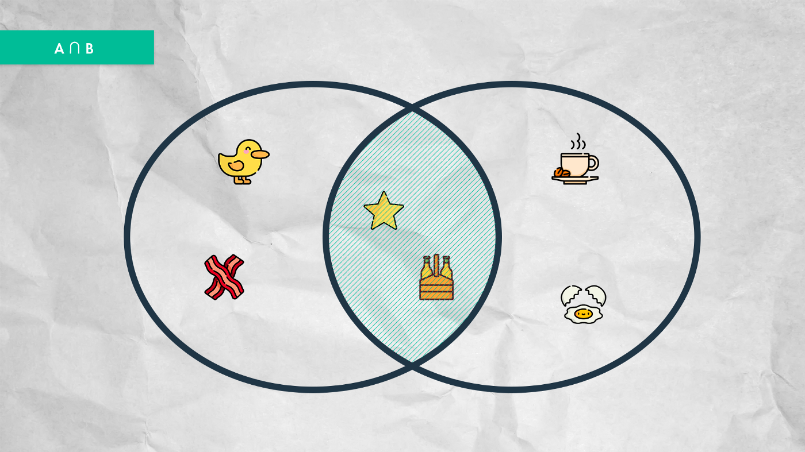
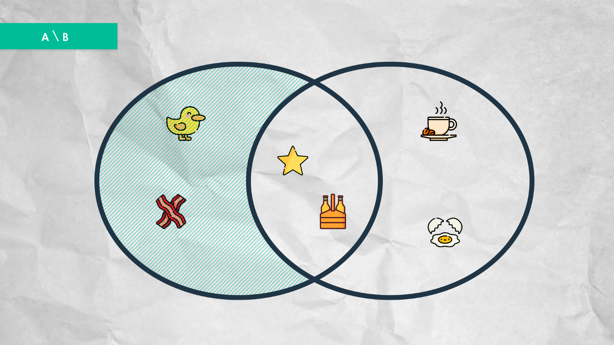
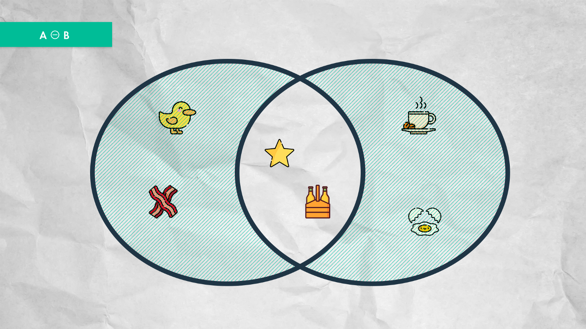

# Array Helpers

[![NPM version][npm-image]][npm-url] [![Downloads][downloads-image]][npm-stats] [![Build Status][travis-image]][travis-url] [![Coveralls Status][coveralls-image]][coveralls-url] [![Codecov Status][codecov-image]][codecov-url] [![Scrutinizer Code Quality][scrutinizer-image]][scrutinizer-url]

Array helpers, so you can get very fast your data from the array.

here an example array.

```javascript
import { Arr } from '@hckrnews/arrays';

var exampleArray = new Arr([
    {
        id: 0,
        name: 'John',
        age: 93,
        city: 'Patmos',
    },
    {
        id: 1,
        name: 'Peter',
        age: 62,
        city: 'Rome',
    },
    {
        id: 2,
        name: 'Luke',
        age: 84,
        city: 'Boeotia'
    },
    {
        id: 2,
        name: 'Paul',
        age: 62,
        city: 'Rome'
    },
]);
```

## multisort

Sort an array with objects by the key of the object.

By default it is asc, and you can set desc as an optional value to the 2nd parameter.

```javascript
exampleArray.multisort('age', 'desc');

[
    {
        id: 0,
        name: 'John',
        age: 93,
        city: 'Patmos',
    },
    {
        id: 2,
        name: 'Luke',
        age: 84,
        city: 'Boeotia'
    },
    {
        id: 1,
        name: 'Peter',
        age: 62,
        city: 'Rome',
    },
    {
        id: 2,
        name: 'Paul',
        age: 62,
        city: 'Rome'
    },
]
```

## multifilter

Filters the array for a given key and value.

If the 3th parameter is true, excluding a given key and value.

```javascript
exampleArray.multifilter('age', '62');

[
    {
        id: 1,
        name: 'Peter',
        age: 62,
        city: 'Rome',
    },
    {
        id: 2,
        name: 'Paul',
        age: 62,
        city: 'Rome'
    },
]


exampleArray.multifilter('age', '62', '!=');

[
    {
        id: 0,
        name: 'John',
        age: 93,
        city: 'Patmos',
    },
    {
        id: 2,
        name: 'Luke',
        age: 84,
        city: 'Boeotia'
    },
]


exampleArray.multifilter('age', '62', '>');

[
    {
        id: 0,
        name: 'John',
        age: 93,
        city: 'Patmos',
    },
    {
        id: 2,
        name: 'Luke',
        age: 84,
        city: 'Boeotia'
    },
]


exampleArray.multifilter('age', '84', '<=');

[
    {
        id: 2,
        name: 'Luke',
        age: 84,
        city: 'Boeotia'
    },
    {
        id: 1,
        name: 'Peter',
        age: 62,
        city: 'Rome',
    },
    {
        id: 2,
        name: 'Paul',
        age: 62,
        city: 'Rome'
    },
]


exampleArray.multifilter('name', ['John', 'Peter']);

[
    {
        id: 0,
        name: 'John',
        age: 93,
        city: 'Patmos',
    },
    {
        id: 1,
        name: 'Peter',
        age: 62,
        city: 'Rome',
    },
]
```

## multikey

Plucks the given keys from the array.

```javascript
exampleArray.multikey(['name', 'age']);

[
    {
        name: 'John',
        age: 93
    },
    {
        name: 'Peter',
        age: 62
    },
    {
        name: 'Luke',
        age: 84
    },
    {
        name: 'Paul',
        age: 62
    },
]
```

## intersect



Computes the intersection of arrays.
Returns an array containing the values that are present in all the arrays.

If the 2nd parameter is true, the 1st parameter can contain multiple arrays.

```javascript
var a = new Arr(['John', 'Peter', 'Luke']);
var b = ['Peter', 'Luke', 'Paul'];
var c = ['Luke', 'Paul', 'John'];

a.intersect(b);

['Peter', 'Luke']


a.intersect([b, c], true);

['Luke']
```

## diff



Computes the difference of arrays.
Compares the array values, and return all values from array a that arent present in array b.

If the 2nd parameter is true, it return all values that are not present in any of the arrays.

```javascript
var a = new Arr(['John', 'Peter', 'Luke']);
var b = ['Peter', 'Luke', 'Paul'];

a.diff(b);

['John']
```

Symmetrical Diff


```javascript
a.diff(b, true);

['John', 'Paul']
```


## unique

Removes duplicate values from an array.
Takes the array and returns a new array without duplicate values.

```javascript
var a = new Arr(['John', 'Peter', 'Luke', 'Peter', 'Luke', 'Paul']);

a.unique;

['John', 'Peter', 'Luke', 'Paul']
```

## pushIfNotExists

Only push the value to the array if the value doesnt exists in the array.

Returns the new length property of the object upon which the method was called.

```javascript
var a = new Arr();

a.pushIfNotExists('John');

['John']

a.pushIfNotExists('Peter');

['John', 'Peter']

a.pushIfNotExists('John');

['John', 'Peter']
```

## pushMultipleIfNotExists

Add multiple values to an array.
Only push the value to the array if the value doesnt exists in the array.

Returns the new length property of the object upon which the method was called.

```javascript
var a = new Arr();

a.pushMultipleIfNotExists([
    'John',
    'Peter'
]);

[
    'John',
    'Peter'
]

a.pushMultipleIfNotExists([
    'Luke',
    'Paul'
]);

[
    'John',
    'Peter',
    'Luke',
    'Paul'
]

a.pushMultipleIfNotExists([
    'John',
    'Peter'
]);

[
    'John',
    'Peter',
    'Luke',
    'Paul'
]
```

## pushMultiple

Add multiple values to an array.

Returns the new length property of the object upon which the method was called.

```javascript
var a = new Arr();

a.pushMultiple([
    'John',
    'Peter'
]);

[
    'John',
    'Peter'
]

a.pushMultiple([
    'Luke',
    'Paul'
]);


[
    'John',
    'Peter',
    'Luke',
    'Paul'
]
```

## max

The largest of the given numbers. If at least one of the arguments cannot be converted to a number, NaN is returned.

```javascript
var exampleArray = new Arr([1,2,3]);

exampleArray.max;

3
```

## min

The smallest of the given numbers. If at least one of the arguments cannot be converted to a number, NaN is returned.

```javascript
var exampleArray = new Arr([1,2,3]);

exampleArray.min;

1
```

## random

Get a random value of an array.

```javascript
var exampleArray = new Arr([1,2,3]);

exampleArray.random;

e.g. 2
```

## summ

The summ of all values.

```javascript
var exampleArray = new Arr([1,2,3]);

exampleArray.summ;

6
```

## average

Get the average of all values.

```javascript
var exampleArray = new Arr([1,2,3]);

exampleArray.average;

2
```

## first

Get the first of all values.

```javascript
var exampleArray = new Arr([1,2,3]);

exampleArray.first;

1
```

## last

Get the last of all values.

```javascript
var exampleArray = new Arr([1,2,3]);

exampleArray.last;

3
```

## update

Update items in an array.

```javascript
var exampleArray = new Arr([
    {
        id: 1,
        name: 'first'
    },
    {
        id: 2,
        name: 'second'
    }
]);

exampleArray.update(
    [
        {
            id: 2,
            name: 'last'
        }
    ],
    [
        'id'
    ]
);

[
    {
        id: 1,
        name: 'first'
    },
    {
        id: 2,
        name: 'last'
    }
]
```


## Test the package.

```
npm test
```

This will run all the tests in the test folder with mocha.

If you only want to check the eslint rules, just run.

```
npm run lint
```

## node.js

To include @hckrnews/arrays in Node, first install with npm.

```
npm install @hckrnews/arrays
```

Use the package in your node files.

```javascript
import { Arr } from '@hckrnews/arrays';
```

Than you can use all array helpers from this package in your node files.

An example is included `example/node.js`


[downloads-image]: https://img.shields.io/npm/dm/@hckrnews/arrays.svg
[npm-url]: https://www.npmjs.com/package/@hckrnews/arrays
[npm-image]: https://img.shields.io/npm/v/@hckrnews/arrays.svg
[npm-stats]: https://npm-stat.com/charts.html?package=@hckrnews/arrays
[travis-url]: https://www.travis-ci.com/github/hckrnews/arrays
[travis-image]: https://www.travis-ci.com/hckrnews/arrays.svg?branch=main
[coveralls-url]: https://coveralls.io/r/hckrnews/arrays
[coveralls-image]: https://img.shields.io/coveralls/hckrnews/arrays/master.svg
[codecov-url]: https://app.codecov.io/gh/hckrnews/arrays
[codecov-image]: https://img.shields.io/codecov/c/github/hckrnews/arrays.svg
[scrutinizer-url]: https://scrutinizer-ci.com/g/hckrnews/arrays/?branch=master
[scrutinizer-image]: https://scrutinizer-ci.com/g/hckrnews/arrays/badges/quality-score.png?b=main
